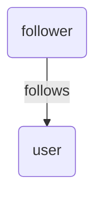
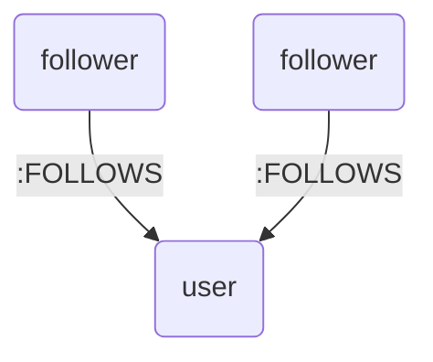
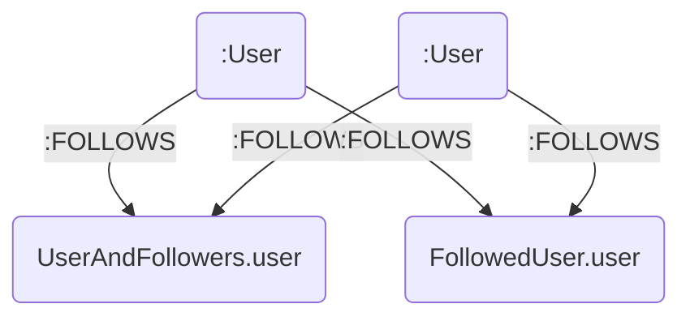

# Spinel

Decorator based OGM for Neo4j.

> Currently in beta version with several steps left before v1 release
> - some additional features
> - detailed documentation
> - bug fixes
> - quality implovement

# Installing

```
npm install @seihmd/spinel
```

# Usage

## Define entities

```typescript
// Define Node entity
@NodeEntity()
class User {
  @Primary()
  private id: string; // Entity must have one primary property

  @Property()
  private name: string;

  constructor(id: string, name: string) {
    this.id = id;
    this.name = name;
  }
}
```

```typescript
// Define Relationship entity
@RelationshipEntity()
class Follows {
  @Primary()
  private id: string;

  constructor(id: string) {
    this.id = id;
  }
}
```

## Define graphs



```typescript
// Define Node-Relationship-Node graph
@Graph('user<-follows-follower')
class UserAndFollower {
  @GraphNode()
  private user: User;

  @GraphRelationship()
  private follows: Follows;

  @GraphNode()
  private follower: User;

  constructor(user: User, follows: Follows, follower: User) {
    this.user = user;
    this.follows = follows;
    this.follower = follower;
  }
}
```



```typescript
@Graph('user')
class UserAndFollowers {
  @GraphNode()
  private user: User;

  @GraphBranch(User, 'user<-[:FOLLOWS]-.')
  private followers: User[];

  constructor(user: User, followers: User[]) {
    this.user = user;
    this.followers = followers;
  }
}
```



```typescript
@GraphFragment('-[:FOLLOWS]->user')
class FollowedUser {
  @GraphNode()
  private user: User;

  constructor(user: User) {
    this.user = user;
  }
}

@Graph('user')
class UserAndFollowers {
  @GraphNode()
  private user: User;

  @GraphBranch(User, 'user<-[:FOLLOWS]-(:User)')
  private usersFollowedBySame: FollowedUser[];

  constructor(user: User, usersFollowedBySame: FollowedUser[]) {
    this.user = user;
    this.usersFollowedBySame = usersFollowedBySame;
  }
}
```

## Configure

Run configure() at the application entry point.

```typescript
import { configure } from '@seihmd/spinel';

configure({
  entities: [User, Follows]
});
```

By default, Neo4j host, user, and password are read from environment variables:

- `SPINEL_HOST`
- `SPINEL_USER`
- `SPINEL_PASSWORD`

Alternatively, the values can be set explicitly.

```typescript
configure({
  host: 'neo4j://localhost',
  user: 'neo4j',
  password: 'pass',
  entities: [User, Follows]
});
```

## Querying

### QueryDriver

`QueryDriver` is the entry point for query execution.

```typescript
const qd = getQueryDriver();
```

### Find

```typescript
// Find entities
const users = await qd
  .find(User)
  .where("user.id IN :userIds") // In WHERE statement, Use capitalCased Entity name
  .orderBy("u.id", 'ASC')
  .limit(2)
  .buildQuery({
    userIds: ['1', '2']
  })
  .run()   // User[]
;

// Find graphs
const userAndFollowersList = await qd
  .find(UserAndFollowers)
  .where("user.id IN :userIds")
  .orderBy("u.id", 'ASC')
  .limit(2)
  .buildQuery({
    userIds: ['1', '2']
  })
  .run()   // UserAndFollowers[]
;
```

### FindOne

```typescript
const query = await qd
  .find(User)
  .where("user.id = $userId")
  .buildQuery({
    userId: '1'
  })
  .run()  // User|null
;
```

### Save

```typescript
const user = new User();
// Save node entity
await qd.save(user);

// Save graph
const userAndFollowers = new UserAndFollowers(user, [new User()]);
await qd.save(userAndFollowers);
```

### Detach

#### Detach between nodes

```typescript
// Detach any relationships having direction `user -> user2`.
await qd.detach(user, user2);

// Detach specified relationship having direction `user -> user2`.
await qd.detach(user, user2, 'FOLLOWS');

// Detach specified relationship having direction `user <- user2`.
await qd.detach(user, user2, 'FOLLOWS', '<-');

// Detach specified relationship regardless direction.
await qd.detach(user, user2, 'FOLLOWS', '-');

// Relationship constructor can also be passed.
await qd.detach(user, user2, Follows);
```

### Delete

#### Delete node

```typescript
await qd.delete(user);
```

#### Delete relationship and graph

`.delete()` does not support Relationship and Graph.
<br>
Use `.detach()` or `.detachDelete()` instead.

### Detach Delete

```typescript
// DETACH DELETE the node
await qd.detachDelete(user);

// DETACH DELETE entities included in the graph
await qd.detachDelete(userAndFollowers);
```

## Transaction

Use `.transactional()`.
<br>
Rollback is executed When callback throws an error.

```typescript
await qd.transactional(async (qd: QueryDriver) => {
  const userAndFollowers = await qd
    .findOne(UserAndFollowers)
    .where('uhop.id=$userId')
    .buildQuery({
      userId: '1',
    })
    .run();

  userAndFollowers.addFollower(new User());

  await qd.save(userAndFollowers);
});
```

## Manage Constraints and Indexes

### Add constraints

#### Unique node property constraints

```typescript
@NodeEntity({
  unique: ['name']
})
class User {
  @Primary()
  private id: string;

  @Property()
  private name: string;
}
```

#### Node/Relationship property existence constraints

```typescript
@NodeEntity()
class User {
  @Primary()
  private id: string;

  @Property({ notNull: true })
  private name: string;
}
```

#### Node key constraints

```typescript
@NodeEntity({
  keys: [['name', 'address']]
})
class User {
  @Primary()
  private id: string;

  @Property()
  private name: string;

  @Property()
  private address: string;
}
```

### Add Indexes

Currentry supports btree, text and full-text index types.

```typescript
@NodeEntity({
  indexes: [
    {
      type: 'btree',
      on: ['name'],
    },
    {
      name: 'index_IndexTestNode_arbitrary_name',
      type: 'fulltext',
      on: ['name', 'description'],
    },
  ],
})
class User {
  @Primary()
  private id: string;

  @Property()
  private name: string;

  @Property()
  private description: string;
}
```

### Synchronize with database

```typescript
await qd.syncConstraints();
```


